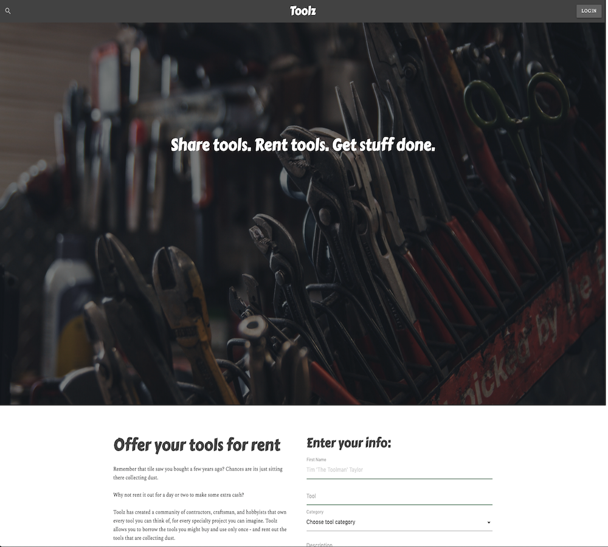

## TOOLZ

# The last tool sharing app you will ever use

* Have a garage full of toolz collecting dust? Have a yard full of downed trees and no chainsaw? 
* Never fear, toolz is here. Founded in October of 2019, toolz is changing the way you complete home improvement tasks and 
use your tools.

## Overview

* The app allows a user to login and create tools for sharing, view a list of the tool marketplace, update tools they previously created, and delete tools they no longer have available for sharing. 
* Brings together Tool Users with tool owners. Helps get projects done faster. Insurance not included.

## Technologies

* Javascript
* Node.js
* Express
* Materialize
* Handlebars

## Toolz App Contributors

* [Trevor Brown](https://github.com/tr3vbr0w) - front-end css, category routes
* [Tyler Ford](https://github.com/tylermorrisford) - front-end, layout, design, hadlebars
* [Dana Alexandrescu](https://github.com/danalittleskier) - back-end, travis ci, models, search routes
* [Guillermo Villalta](https://github.com/mexcelus) - back-end, login, models, authentication routes

### App Link

The application was deployed on Heroku

https://project-foo-bar.herokuapp.com/

### Screenshot

### GitHub Link

https://github.com/danalittleskier/ProjectTwo

